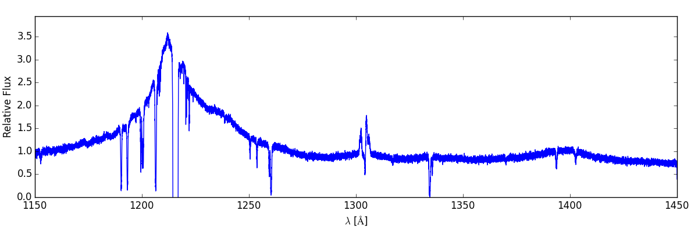

.. _making-spectra:

Making Spectra
==============

Making spectra with Trident is intended to require a minimal amount of effort by the user.  This section will walk you through the steps necessary to produce a synthetic spectrum based on simulation data.

The basic process requires two main steps:

    1. Extract a light ray from the simulation data.
    2. Define the desired spectrum features and use the light ray to generate the corresponding synthetic spectrum.

First, we'll go through the process for extracting a light ray from your simulation data.

Light Ray Generation
--------------------

In order to generate a light ray from your data, you need to first make sure that you've imported both the yt and Trident packages:

.. code-block:: python

   import yt
   import trident

Then, you need to specify which dataset to extract the light ray from (for this example, we'll be using an Enzo dataset but the process should work for other data formats and simulation types):

.. code-block:: python

   fn = 'enzo_cosmology_plus/RD0009/RD0009'

From here, we can generate the light ray using the LightRay class and the make_light_ray function contained within that class:

.. code-block:: python

    light_ray = trident.LightRay(fn)
    ray = light_ray.make_light_ray(start_position=[0,0,0],
                                   end_position=[1,1,1],
                                   solution_filename="ray_solution.txt",
                                   data_filename="ray.h5",
                                   fields=['temperature', 'density',
                                           'H_number_density', 'metallicity'])

.. note::
    In this example we are extracting a light ray from a single dataset and specifying the start and end point of the light ray.  It is also possible to generate a random light ray that spans a random in redshift space and is generated from multiple simulation snapshots.  For the details on creating such a light ray, refer to **WE NEED TO PUT A REFERENCE TO SOMETHING HERE**

Now that we have our light ray, we can use it to generate a spectrum.

Spectrum Generation
-------------------

To generate a spectrum, we first need to initialize a SpectrumGenerator object and then we can make a basic "clean" spectrum that just contains the absorption features created by the densities, temperatures, and metallicities of the line elements in the light ray.

.. code-block:: python

    # Create a spectrum that uses the wavelength range, line spread function,
    # and spectral resolution of the Cosmic Origins Spectrograph ('COS')
    sg = trident.SpectrumGenerator('COS')
    sg.make_spectrum(ray, output_file="spec.h5")

From here we can modify the spectrum to include additional features that would be present in an observed spectrum.

.. code-block:: python

    # Modify the clean spectrum to produce an "observed" spectrum with added
    # composite quasar spectrum, MW foreground features, and gaussian noise
    # with SNR=30
    sg.add_qso_spectrum()
    sg.add_milky_way_foreground()
    sg.apply_lsf()
    sg.add_gaussian_noise(30)

Finally, we use Trident's plot_spectrum function to plot the spectrum that we've created by accessing the wavelength and flux values contained within our SpectrumGenerator object.

.. code-block:: python

    trident.plot_spectrum(sg.lambda_field, sg.flux_field, 'spectrum.png')

which produces:

To create more complex or ion-specific spectra, refer to :ref:`advanced-spectra`
